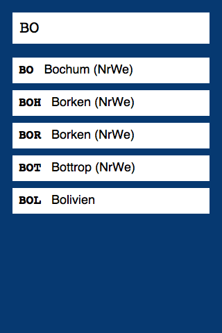

# KFZ-Kennzeichen

Offlinefähige mobile Web App zur Auflösung von KFZ-Kennzeichen – ermöglicht es, nach deutschen, internationalen und Diplomatenkennzeichen zu suchen.

Verwendet Classes, fetch, Service Worker, Promises, Arrow Functions und Template Strings. Funktioniert in Chrome, Opera und Firefox ab Version 45.

Die Daten stammen von [kfz-auskunft.de](http://www.kfz-auskunft.de/autokennzeichen/autokennzeichen.html) und das Icon von [aiga.org](http://www.aiga.org/symbol-signs/).

